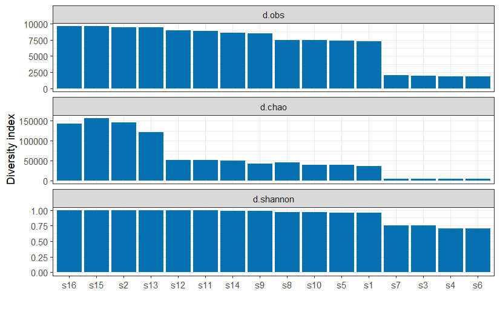
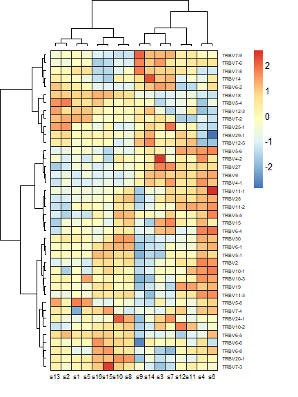
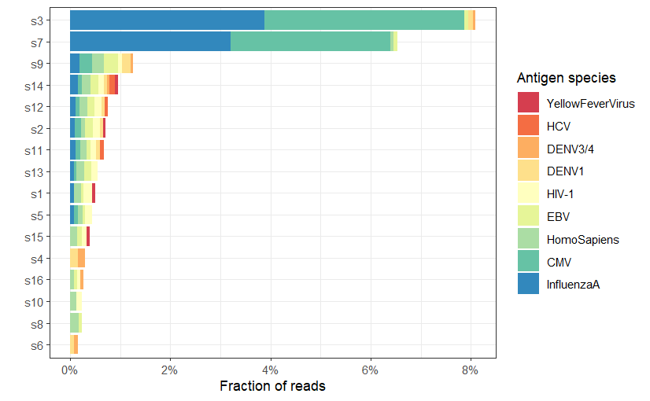
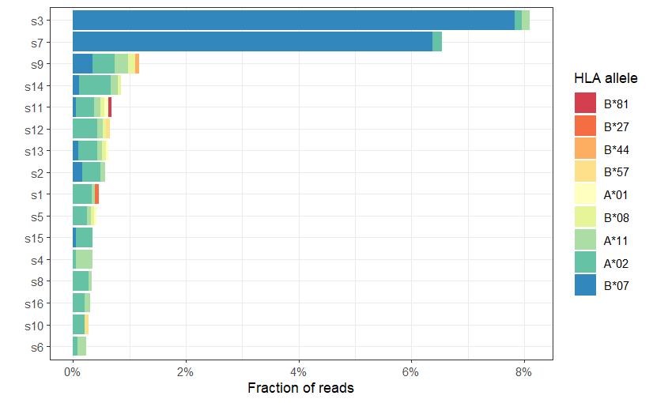

## Introduction
Repertoire Sequencing (RepSeq) analysis is a high-throughput method used to characterize the diversity of T/B-cell receptors (TCR/BCR) and antibodies. RepSeq provides a detailed overview of immune repertoires, allowing to monitor immune responses and search for antigen markers to describe different states such as various infections, autoimmune diseases, cancer.

In this tutorial we focus on TCR repertoire annotation. This analysis uses 16 samples of 10,000 random reads from two donors from [Qi et al. PNAS 2014](http://www.pnas.org/content/111/36/13139.short) study (sample labels and TCR nucleotide sequences are removed).

## Diversity annotation

The diversity in memory cells is lower than in naive cells. Thus, according to Normalized Shannon and Chao1 diversity indices calculations — 4 samples (s7, s3, s4, s6) have much lower diversity and can be identified as `memory` cells. 

And final `memory` cell set is:
* s1/s5
* s3/s7
* s4/s6
* s8/s10

This conclusion is drawn by looking at d.obs distribution.

## V segment usage profile

### Classification of samples by replicas

The heatmap of overlapped clonotype lists highlights the replicas in the data:

Replicas:
* s3/s7
* s4/s6
* s8/s10
* s1/s5
* s2/s13
* s15/s16
* s9/s14
* s11/s12

## Repertoire annotation

### Cell subset identification (CD8/CD4)
According to the results of the alignment to the VDJdb database of specific human CD8 TRB
sequences, the samples with the largest number of reads belong to CD8 (let's look at the `vusage` file from tutorial). Thus, after brief inspection, sample pairs are:
* s3/s7
* s9/s14
* s4/s6

As CD8 memory T cells were 5- to 10-fold less diverse in Vs than CD4 memory T cells in the source article. 

Therefore, CD8 cells also include s11/s12 Thus, all 8 samples on the right side of the diagram are clustered and can be interpretated as CD8.
The rest is CD4 subset: 
* s2/s13 
* s1/s5 
* s15/s16
* s8/s10

### Annotation of antigen-specific TCR sequences

CMV status annotation:

On this image the parent species of putative antigens are described. It can be interpreted that s3 and s7 belong to CMV+ donor as they show around 3-4% fraction of the matching reads.

Based on the results of alignment to the specific Homo Sapiens CD8 TRB sequences, s4/s6 and s11/s12 are taken from the CMV- donor because the CMV antigen is not associated with these samples.

### HLA annotation

The final step of the RepSeq investigation is HLA allele identification. 

The CMV+ donor has B*07 HLA allele (s3 and s7 samples). Therefore, draw a conclusion using the putative antigen TCR recognition map. 
And now we can spot CMV+ donor (D1) samples by HLA allele:
* s3/s7
* s9/s14
* s2/s13
* s1/s5

## The final table

| Sample | Donor | Subset | Phenotype | CMV status |
|--------|-------|--------|-----------|------------|
| s1     | D1    | CD4    | memory    | CMV+       |
| s2     | D1    | CD4    | naive     | CMV+       |
| s3     | D1    | CD8    | memory    | CMV+       |
| s4     | D2    | CD8    | memory    | CMV-       |
| s5     | D1    | CD4    | memory    | CMV+       |
| s6     | D2    | CD8    | memory    | CMV-       |
| s7     | D1    | CD8    | memory    | CMV+       |
| s8     | D2    | CD4    | memory    | CMV-       |
| s9     | D1    | CD8    | naive     | CMV+       |
| s10    | D2    | CD4    | memory    | CMV-       |
| s11    | D2    | CD8    | naive     | CMV-       |
| s12    | D2    | CD8    | naive     | CMV-       |
| s13    | D1    | CD4    | naive     | CMV+       |
| s14    | D1    | CD8    | naive     | CMV+       |
| s15    | D2    | CD4    | naive     | CMV-       |
| s16    | D2    | CD4    | naive     | CMV-       |

